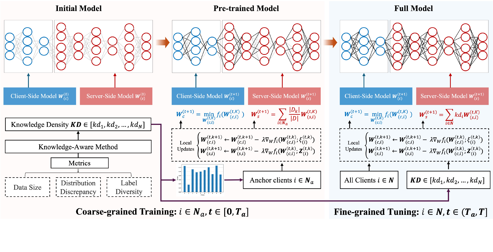

# FCSL
Implementation of paper "FCSL: Faster-Convergence Split Federated Learning on Asymmetrical Knowledge Density"
## Overview

FCSL leverages an efficient collaboration learning in a "first coarse-grained training and then fine-grained
tuning" manner, to train an optimal global model under situation of Asymmetric Knowledge Density.

## Use the code

### Requirements
1. Simply run `pip install -r requirements.txt`
2. This work use the visualization tools `wandb` to record performance metrics, please go to www.wandb.ai for instructions.

### Configurations
1. Different experimental settings can be configured by `json-config.py`. 
2. For example: `python json-config.py -c ./utils/conf.json -dt "cifar10" -nu 10 -ac 3 -nd 10 -db 0.5`, where the dataset is CIFAR10, total number of clients is 10, the number of anchor clients is 3, and the coefficients of the Dirichlet distribution is 0.5.

### Run
To run FCSL, simply call `python main.py -c ./utils/conf.json`.

### Check the results
The experimental results are printing on screen (terminal) and wandb panel.

## Cite
Please cite our paper if it is helpful.